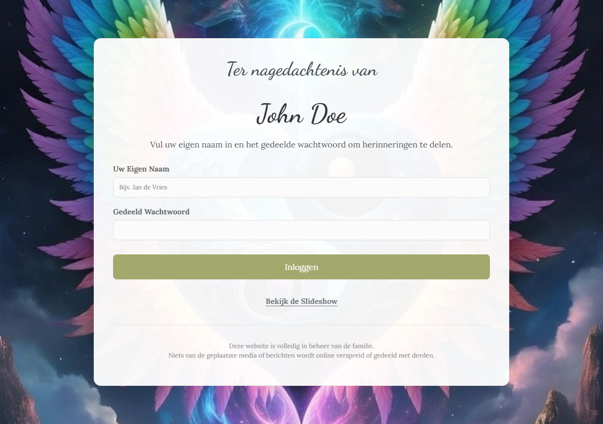
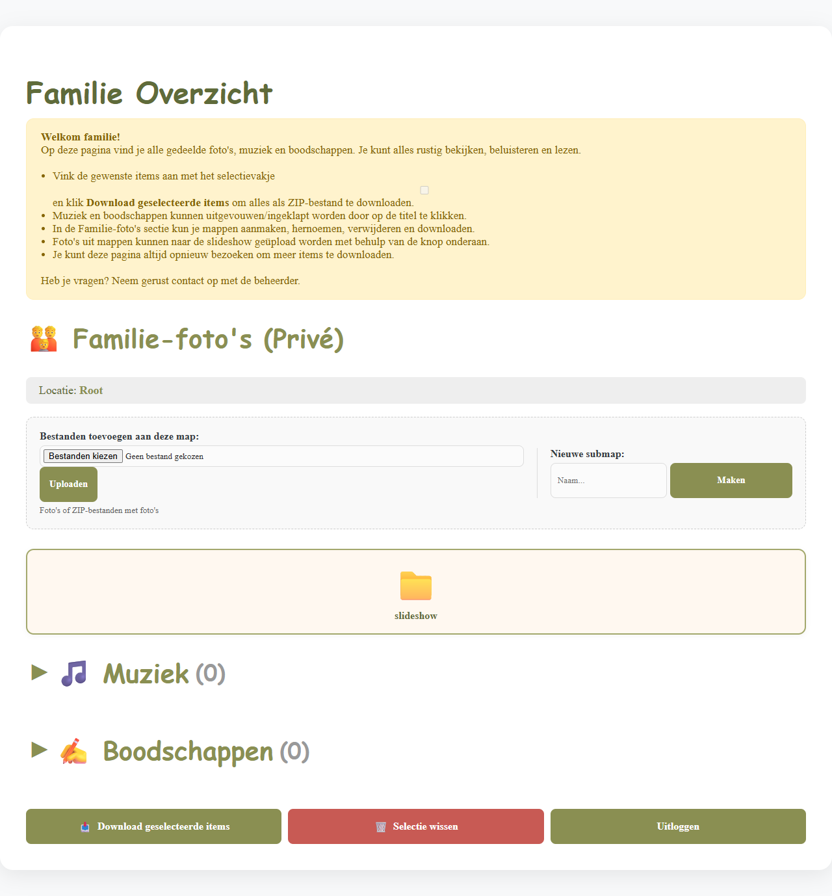
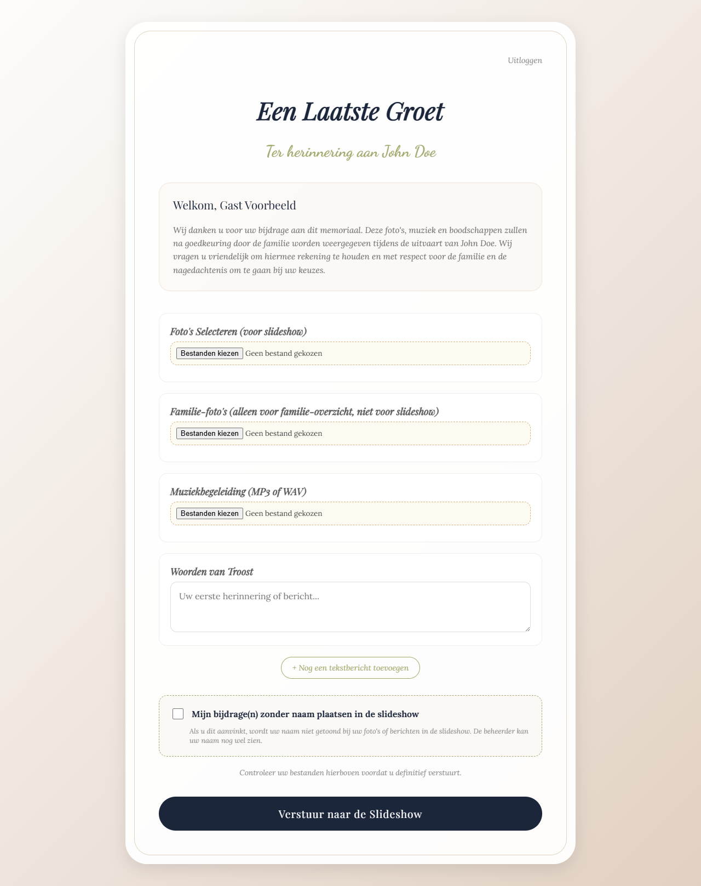
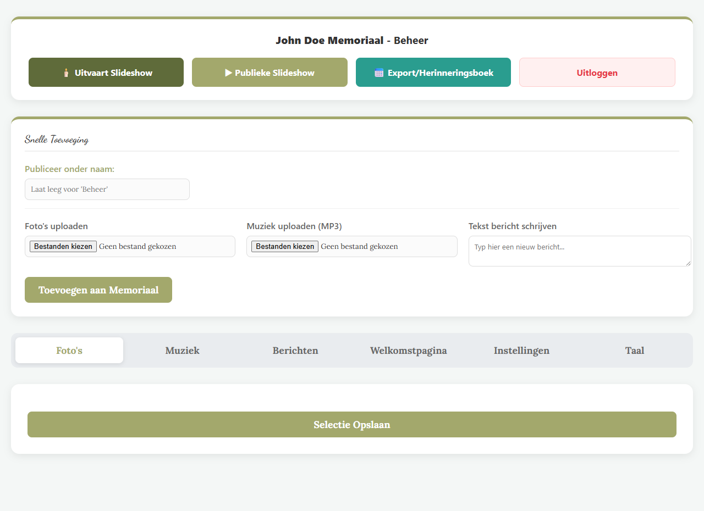
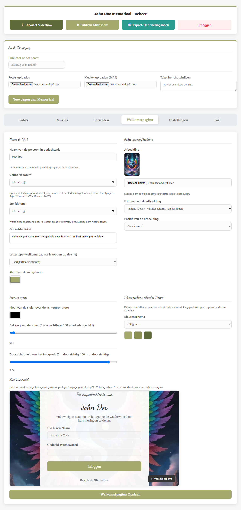
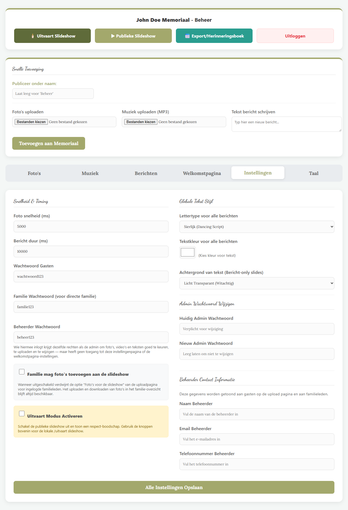
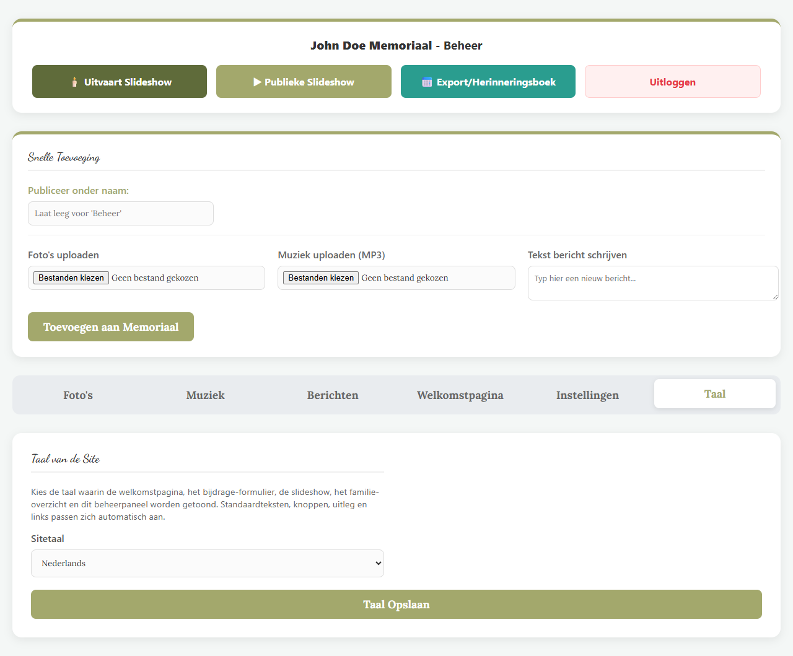
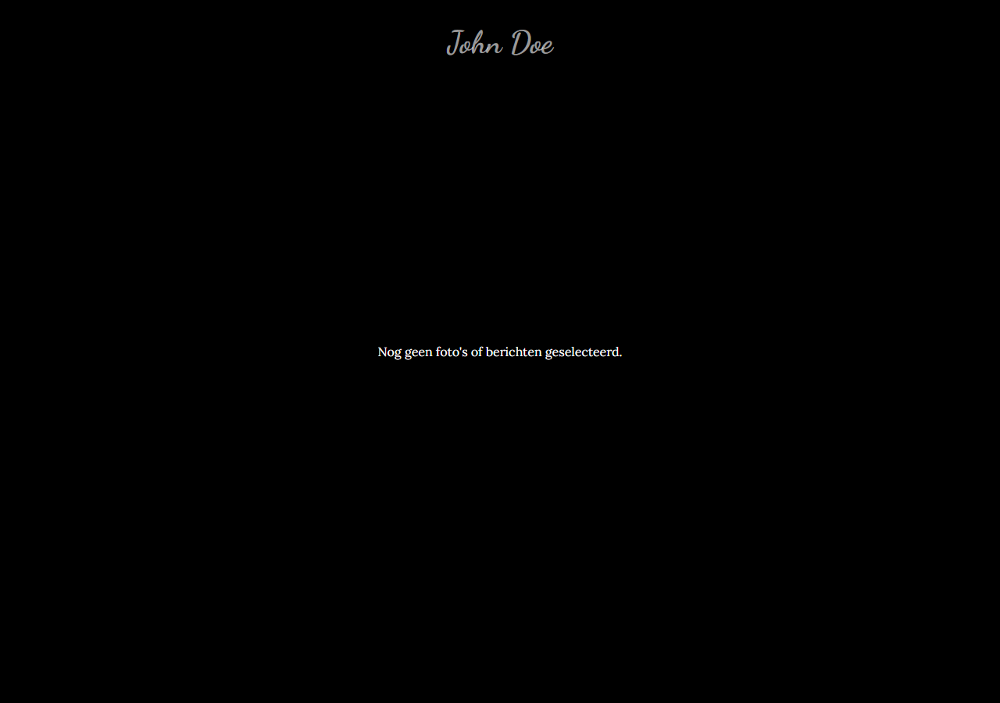
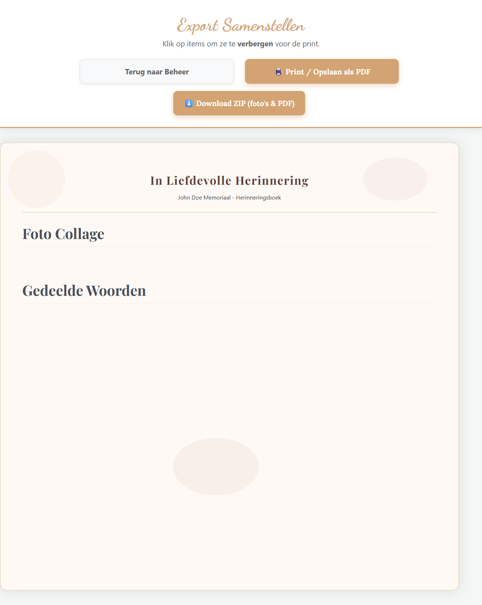

# Memorys — Online Memoriaal

Een privé, wachtwoord-beveiligde website om herinneringen, foto's, muziek en
boodschappen te verzamelen ter nagedachtenis aan een overleden dierbare.
Familie en gasten loggen in met een gedeeld wachtwoord (geen accounts nodig),
en kunnen foto's, muziek en berichten toevoegen die na goedkeuring in een
slideshow verschijnen — bijvoorbeeld tijdens de uitvaart.

De site is volledig in eigen beheer: er wordt niets gedeeld met derden of
online diensten.

## Functionaliteiten

- **Eén loginformulier, meerdere rollen** — dezelfde pagina logt gasten,
  familie, beheerders (moderators) en de admin in, puur op basis van het
  ingevoerde wachtwoord.
- **Gast-bijdragepagina** — foto's, muziek en troostwoorden toevoegen, met
  optie om anoniem te blijven.
- **Familie-overzicht** — alle gedeelde foto's, muziek en berichten
  doorzoeken, beluisteren en als ZIP downloaden; eigen privé familie-fotomap
  met submappen.
- **Admin-paneel** — foto's/muziek/berichten goedkeuren en beheren, de
  welkomstpagina en het kleurenschema aanpassen, wachtwoorden en
  site-instellingen wijzigen, en de sitetaal kiezen (NL/EN/ES/FR/PT).
- **Slideshow** — publieke slideshow voor onderweg, plus een aparte
  "uitvaart"-slideshow-modus voor lokaal gebruik tijdens de plechtigheid.
- **Herinneringsboek-export** — alle foto's en berichten samenstellen tot een
  printbare pagina of downloaden als ZIP (foto's + PDF).

## Schermafbeeldingen

| Welkomstpagina | Familie-overzicht | Gast-bijdragepagina |
|---|---|---|
|  |  |  |

| Admin — Foto's | Admin — Welkomstpagina | Admin — Instellingen |
|---|---|---|
|  |  |  |

| Admin — Taal | Slideshow | Herinneringsboek-export |
|---|---|---|
|  |  |  |

## Techniek

- PHP (procedureel, geen framework)
- MySQL / MariaDB
- Draait op elke standaard Apache+PHP+MySQL-stack (bijv. XAMPP)

## Installatie

1. Zet de projectmap in je webroot (bijv. `htdocs/memorys` bij XAMPP).
2. Maak een database aan en importeer `fresh_install.sql` — dit maakt lege
   tabellen aan met één standaard admin-account, zonder persoonlijke data.
3. Kopieer `private/config.example.php` naar `private/config.php` en vul de
   databasegegevens voor jouw omgeving in.
4. Log in op `/index` met:
   - Gebruikersnaam: `admin`
   - Wachtwoord: `admin1234`

   **Wijzig dit wachtwoord direct na de eerste login** via het admin-paneel
   (tab "Instellingen").
5. Stel via het admin-paneel de gedeelde wachtwoorden in voor gasten,
   familie en eventuele beheerders, en pas de welkomstpagina en instellingen
   naar wens aan.

## Structuur

- `index.php` — welkomst-/loginpagina (alle rollen)
- `upload.php` — bijdragepagina voor gasten
- `family_overview.php` — overzicht en privé-fotobeheer voor familie
- `admin.php` — beheerpaneel
- `slideshow.php` / `uitvaart.php` — publieke resp. lokale uitvaart-slideshow
- `export.php` / `download_export.php` — herinneringsboek samenstellen/downloaden
- `private/` — configuratie en taalbestanden (niet publiek toegankelijk)

## Licentie

Dit project is uitgebracht onder de GNU General Public License v3.0 — zie
[LICENSE](LICENSE).
